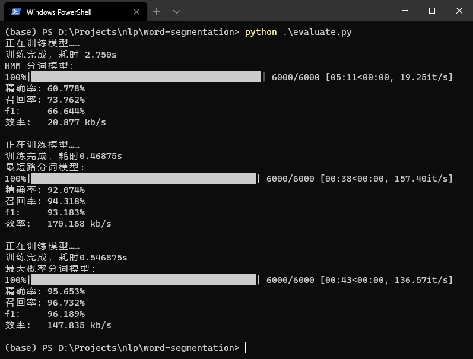
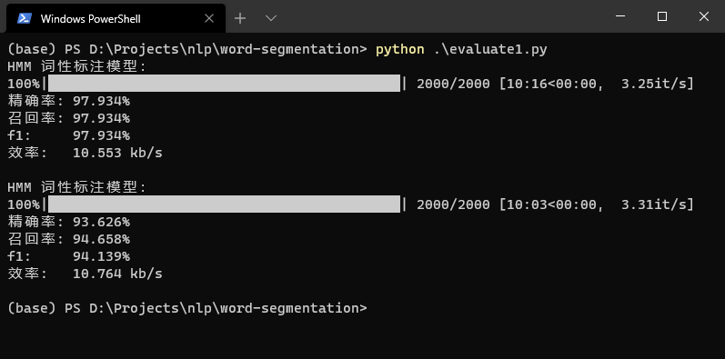

<h1 style="text-align: center"> 中文分词和词性标注 <h1>
## 1、实验目的

（1）  实现基于词典的分词方法和基于统计的分词方法。

（2）  对分词结果进行词性标注。

（3）  对分词结果、词性标注结果进行评价。

## 2、实验内容

### 2.1、程序文件结构

```shell
.
│  evaluate.py		# 评估脚本
│  utils.py			# 数据清洗、数据集划分、评价函数等
│
├─ data
│      HmmParam_Token.json			# hmm 分词模型参数
│      word_freq_npath.json			# 最大概率分词模型参数
│      PeopleDaily_clean.txt		# 数据清洗后的人民日报语料
│      PeopleDaily_Token.txt		# 去掉词性标注的人民日报语料
│      PeopleDaily_Token_hmm.txt	# hmm 分词结果
│      PeopleDaily_Token_npath.txt	# 最大概率分词结果
│      RemovePostag.py
│
└─ models
       HmmPosTag.py  	# HMM 词性标注类
       HmmToken.py		# HMM 分词类
       ShortTokenizer.py	# 最短路分词类、最大概率分词类
```

### 2.2、基于统计的分词方法（隐马尔可夫模型）

源代码路径：*./models/HmmToken.py*

#### （1）算法设计
 采用隐马尔科夫（Hmm）模型进行统计分词。使用BMES标注方法，将分词任务转换为字标注的问题，通过对每个字进行标注得到词语的划分。具体来说，BMES标注方法是用“B、M、E、S”四种标签对词语中不同位置的字符进行标注，B表示一个词的词首位置，M表示一个词的中间位置，E表示一个词的末尾位置，S表示一个单独的字词。
 字标注的问题可视为隐马尔可夫模型中的解码问题。句子的BMES标注序列作为隐藏状态序列，句子的字符序列作为可观测序列，通过以下两个步骤实现分词：

1. 学习模型参数
   对预料进行统计，获得隐藏状态的转移概率矩阵trans、发射概率矩阵emit 、初始状态矩阵start
   1. 观测序列$O$ ：句子的字符序列 $[w_0,w_1,……w_n]$
   2. 隐藏序列 $S$：BMES标注序列 $[p_0,p_1,……p_n]$
   3. 初始概率 $π$ ：$start(i)=P_{(p_0=i)}=count(p_0=i)/count(sentence) \quad i\in{B、M、E、D}$
   4. 转移概率 $trans$ ：$trans(i,j)=P(j│i)=count(p_k=i ,p_{k+1}=j)/count(i)     i,j ∈{B、M、E、D}$
   5. 发射概率 $emit$ ：$emit(i,w)=P(w│i)=count(state(w)=i)/count(i) \quad i\in{B、M、E、D}$,

2. 使用 Viterbi 算法预测 
   Viterbi算法是用动态规划的方法求解最优的标注序列。主要由以下几步实现：
   1. 状态$dp[i][j]$：表示第$i$个字符，标签为$j$ 的所有路径中的最大概率。
   2. 记录路径 $path[i][j]$：表示$dp[i][j]$为最大概率时，第$i-1$个字符的标签
   3. 状态初始化：$dp[0][j] =start(j) emit(j,w_0)$
   4. 递推（状态转移方程）：$dp[i][j]=   max_{k\in \{pos\}}⁡(dp[i-1][k]×trans[k,j])  × emit[j,w_i]$
   5. 记录路径：$path[i][j]=arg⁡max_{k∈\{pos\}}⁡(dp[i-1][k]×trans[k,j])$ 
   6. 回溯最优路径：$p_i=path[i+1][p_(i+1) ] \quad i=n-1,n-2,……1,0$
   7. 输出最优路径：$[p_1,p_2……p_n]$

#### （2）程序结构

```python
# -*- encoding: utf-8 -*-
import time
import json
import pandas as pd


class Hmm:
    def __init__(self):
        self.trans_p = {'S': {}, 'B': {}, 'M': {}, 'E': {}}
        self.emit_p = {'S': {}, 'B': {}, 'M': {}, 'E': {}}
        self.start_p = {'S': 0, 'B': 0, 'M': 0, 'E': 0}
        self.state_num = {'S': 0, 'B': 0, 'M': 0, 'E': 0}
        self.state_list = ['S', 'B', 'M', 'E']
        self.line_num = 0
        self.smooth = 1e-6

    @staticmethod
    def __state(word):
        """获取词语的BOS标签，标注采用 4-tag 标注方法，
        tag = {S,B,M,E}，S表示单字为词，B表示词的首字，M表示词的中间字，E表示词的结尾字

        Args:
            word (string): 函数返回词语 word 的状态标签
        """
        if len(word) == 1:
            state = ['S']
        else:
            state = list('B' + 'M' * (len(word) - 2) + 'E')
        return state

    def train(self, filepath, save_model=False):
        """训练hmm, 学习发射概率、转移概率等参数

        Args:
            save_model: 是否保存模型参数
            filepath (string): 训练预料的路径
        """
        print("正在训练模型……")
        start_time = time.thread_time()
        with open(filepath, 'r', encoding='utf8') as f:
            for line in f.readlines():
                self.line_num += 1
                line = line.strip().split()
                # 获取观测（字符）序列
                char_seq = list(''.join(line))
                # 获取状态（BMES）序列
                state_seq = []
                for word in line:
                    state_seq.extend(self.__state(word))
                # 判断是否等长
                assert len(char_seq) == len(state_seq)
                # 统计参数
                for i, s in enumerate(state_seq):
                    self.state_num[s] = self.state_num.get(s, 0) + 1.0
                    self.emit_p[s][char_seq[i]] = self.emit_p[s].get(
                        char_seq[i], 0) + 1.0
                    if i == 0:
                        self.start_p[s] += 1.0
                    else:
                        last_s = state_seq[i - 1]
                        self.trans_p[last_s][s] = self.trans_p[last_s].get(
                            s, 0) + 1.0
        # 归一化：
        self.start_p = {
            k: (v + 1.0) / (self.line_num + 4)
            for k, v in self.start_p.items()
        }
        self.emit_p = {
            k: {w: num / self.state_num[k]
                for w, num in dic.items()}
            for k, dic in self.emit_p.items()
        }
        self.trans_p = {
            k1: {k2: num / self.state_num[k1]
                 for k2, num in dic.items()}
            for k1, dic in self.trans_p.items()
        }
        end_time = time.thread_time()
        print("训练完成，耗时 {:.3f}s".format(end_time - start_time))
        # 保存参数
        if save_model:
            parameters = {
                'start_p': self.start_p,
                'trans_p': self.trans_p,
                'emit_p': self.emit_p
            }
            jsonstr = json.dumps(parameters, ensure_ascii=False, indent=4)
            param_filepath = "./data/HmmParam_Token.json"
            with open(param_filepath, 'w', encoding='utf8') as jsonfile:
                jsonfile.write(jsonstr)

    def viterbi(self, text):
        """Viterbi 算法

        Args:
            text (string): 句子

        Returns:
            list: 最优标注序列
        """
        text = list(text)
        dp = pd.DataFrame(index=self.state_list)
        # 初始化 dp 矩阵 (prop，last_state)
        dp[0] = [(self.start_p[s] * self.emit_p[s].get(text[0], self.smooth),
                  '_start_') for s in self.state_list]
        # 动态规划地更新 dp 矩阵
        for i, ch in enumerate(text[1:]):  # 遍历句子中的每个字符 ch
            dp_ch = []
            for s in self.state_list:  # 遍历当前字符的所有可能状态
                emit = self.emit_p[s].get(ch, self.smooth)
                # 遍历上一个字符的所有可能状态，寻找经过当前状态的最优路径
                (prob, last_state) = max([
                    (dp.loc[ls, i][0] * self.trans_p[ls].get(s, self.smooth) *
                     emit, ls) for ls in self.state_list
                ])
                dp_ch.append((prob, last_state))
            dp[i + 1] = dp_ch
        # 回溯最优路径
        path = []
        end = list(dp[len(text) - 1])
        back_point = self.state_list[end.index(max(end))]
        path.append(back_point)
        for i in range(len(text) - 1, 0, -1):
            back_point = dp.loc[back_point, i][1]
            path.append(back_point)
        path.reverse()
        return path

    def cut(self, text):
        """根据 viterbi 算法获得状态，根据状态切分句子

        Args:
            text (string): 待分词的句子

        Returns:
            list: 分词列表
        """
        state = self.viterbi(text)
        cut_res = []
        begin = 0
        for i, ch in enumerate(text):
            if state[i] == 'B':
                begin = i
            elif state[i] == 'E':
                cut_res.append(text[begin:i + 1])
            elif state[i] == 'S':
                cut_res.append(text[i])
        return cut_res


# if __name__ == "__main__":
#     hmm = Hmm()
#     hmm.train('./data/PeopleDaily_Token.txt', save_model=True)
#     cutres = hmm.cut('中央电视台收获一批好剧本')
#     print(cutres)
```

### 2.3、基于字典的分词方法（最短路分词模型）

源代码路径：*./models/ShortTokenizer.py*

#### （1）  算法设计

最短路分词模型的主要思想是将句子中的所有字符当作节点，根据字典找出句子中所有的词语，将词语两端的字符连接起来，构成从词首指向词尾的一条边。通过找出所有的候选词，构建出一个有向无环图（DAG）。找到从句首字符到句尾字符的最短路径，即可作为句子的分词结果。最短路径分词方法采用的规则使切分出来的词数最少，符合汉语自身的规律。

最短路分词算法，由以下几个步骤实现：

①  构造句子的切分图，如果句子 $sentence$ 的子串 $w[i:j]$ 在词典中，则添加边 $V(i,j)$，得到句子的有向无环图 DAG

②  采用Dijkstra 算法动态规划地求解最短路径，$dp[i]$  表示DAG中句首到第 $i$ 个字符的路径长度

③  状态转移函数如下: $dp[i] = min{dp[j-1] + 1}$ ；其中：$i$ 为当前边的起点，$j$ 为当前边的终点。

④   回溯最优路径

#### （2）程序结构

```python
# -*- encoding: utf-8 -*-
import json
import math
import time


class ShortTokenizer:
    def __init__(self, use_freq=True):
        self.word_freq = {}
        self.word_num = 0
        self.use_freq = use_freq

    def train(self, filepath, trained=False):
        """根据训练语料统计词频

        Args:
            filepath (string): 训练语料文件路径
            trained (bool): 模型是否已经训练
        """
        if not trained:
            # 统计词频
            print("正在训练模型……")
            stime = time.thread_time()
            with open(filepath, 'r', encoding='utf8') as f:
                for line in f.readlines():
                    line = line.strip().split()
                    self.word_num += len(line)
                    self.word_freq.update({i: self.word_freq.get(i, 0) + 1 for i in line})
            etime = time.thread_time()
            print("训练完成，耗时{}s".format(etime - stime))
            # 保存词频
            jsonstr = json.dumps(self.word_freq, ensure_ascii=False, indent=4)
            with open('./data/word_freq_npath.json', 'w',
                      encoding='utf8') as f:
                f.write(jsonstr)
        else:
            # 读入词频
            with open(filepath, 'r', encoding='utf8') as f:
                jsonstr = ''.join(f.readlines())
                self.word_freq = json.loads(jsonstr)
                self.word_num = sum(self.word_freq.values())

    def __weight(self, word):
        """计算word的词频 -log(P(w)) = log(num) - log(k_w)

        Args:
            word (string): 切分的词语，切分图上的一条边

        Returns:
            float: 词典中存在该词返回 -log(P)，否则返回0
        """
        freq = self.word_freq.get(word, 0)
        if freq and self.use_freq:
            return math.log(self.word_num) - math.log(freq)
        elif freq:
            return 1
        else:
            return 0

    def Token(self, sentence):
        """结合统计信息的最短路分词函数（最大概率分词）

        Args:
            sentence (string): 待切分的句子

        Returns:
            list: 切分的词语，构成的 list
        """
        length = len(sentence)
        # 构造句子的切分图
        graph = {}
        for i in range(length):
            graph[i] = []
            for j in range(i):
                freq = self.__weight(sentence[j:i + 1])
                if freq:
                    graph[i].append((j, freq))
        # 动态规划求解最优路径 ( arg min[-log(P)] )
        # 初始化DP矩阵
        dp = [(i, self.__weight(sentence[i])) for i in range(length)]
        dp.insert(0, (-1, 0))
        # 状态转移函数：dp[i] = min{dp[j-1] + weight(sentence[j:i])}
        # i：为当前词的词尾；j: 为当前词的词头
        for i in range(2, len(dp)):
            index = dp[i][0]
            cost = dp[i][1] + dp[i - 1][1]
            for j, freq in graph[i - 1]:
                if freq + dp[j][1] < cost:
                    cost = freq + dp[j][1]
                    index = j
            dp[i] = (index, cost)
        # 回溯最优路径
        token_res = []
        break_p = length
        while break_p > 0:
            token_res.append(sentence[dp[break_p][0]:break_p])
            break_p = dp[break_p][0]
        token_res.reverse()
        return token_res


# if __name__ == "__main__":
#     Tokenizer = ShortTokenizer()
#     # Tokenizer.train('./data/PeopleDaily_Token.txt')
#     Tokenizer.train('./data/word_freq_npath.json', trained=True)
#     Tokenizer.Token('迈向充满希望的新世纪')
#     Tokenizer.Token('１９９７年，是中国发展历史上非常重要的很不平凡的一年。')
```


### 2.4、改进最短路分词模型（最大概率模型）

源代码路径：*./models/ShortTokenizer.py*

#### （1）算法设计

最短路分词方法构建有向无环图DAG的过程中，只要词语在字典中出现即可添加边，忽略了成词的概率。现在考虑成词的概率，通过极大似然估计，以词频表示成词概率，为DAG的每条边赋予权重，优化分词结果。通过Dijkstra算法求得的带权最短路径即为所有分词结果中概率最大的分词方法。该分词方法本质上是使用了1-gram文法的最大概率分词模型。

#### （2）程序结构

同最短路分词模型的实现程序，实例化模型时传入 `use_freq = True` 参数。

### 2.5、隐马尔可夫模型进行词性标注

源代码路径：*./models/HmmPosTag.py*

#### （1）算法设计

词性标注是序列标注问题，可采用Hmm模型的解码问题的解决方法。将词性序列作为隐藏序列，将词语序列作为观测序列，同过Viterbi算法预测最优的词性序列。算法实现步骤同[2.2基于统计的分词方法（隐马尔可夫模型）](#_2.2、基于统计的分词方法（隐马尔可夫模型）)

#### （2）程序结构

```python
# -*- coding: UTF-8 -*-
import json
import math
import pandas as pd


class HmmPosTag:
    def __init__(self):
        self.trans_prop = {}
        self.emit_prop = {}
        self.start_prop = {}
        self.poslist = []
        self.trans_sum = {}
        self.emit_sum = {}

    def __upd_trans(self, curpos, nxtpos):
        """更新转移概率矩阵

        Args:
            curpos (string): 当前词性
            nxtpos (string): 下一词性
        """
        if curpos in self.trans_prop:
            if nxtpos in self.trans_prop[curpos]:
                self.trans_prop[curpos][nxtpos] += 1
            else:
                self.trans_prop[curpos][nxtpos] = 1
        else:
            self.trans_prop[curpos] = {nxtpos: 1}

    def __upd_emit(self, pos, word):
        """更新发射概率矩阵

        Args:
            pos (string): 词性
            word (string): 词语
        """
        if pos in self.emit_prop:
            if word in self.emit_prop[pos]:
                self.emit_prop[pos][word] += 1
            else:
                self.emit_prop[pos][word] = 1
        else:
            self.emit_prop[pos] = {word: 1}

    def __upd_start(self, pos):
        """更新初始状态矩阵

        Args:
            pos (string): 初始词语的词性
        """
        if pos in self.start_prop:
            self.start_prop[pos] += 1
        else:
            self.start_prop[pos] = 1

    def train(self, data_path):
        """训练 hmm 模型、求得转移矩阵、发射矩阵、初始状态矩阵

        Args:
            data_path (string): 训练数据的路径
        """
        f = open(data_path, 'r', encoding='utf-8')
        for line in f.readlines():
            line = line.strip().split()
            # 统计初始状态的概率
            self.__upd_start(line[0].split('/')[1])
            # 统计转移概率、发射概率
            for i in range(len(line) - 1):
                self.__upd_emit(line[i].split('/')[1], line[i].split('/')[0])
                self.__upd_trans(line[i].split('/')[1], line[i + 1].split('/')[1])
            i = len(line) - 1
            self.__upd_emit(line[i].split('/')[1], line[i].split('/')[0])
        f.close()
        # 记录所有的 pos
        self.poslist = list(self.emit_prop.keys())
        self.poslist.sort()
        # 统计 trans、emit 矩阵中各个 pos 的归一化分母
        num_trans = [
            sum(self.trans_prop[key].values()) for key in self.trans_prop
        ]
        self.trans_sum = dict(zip(self.trans_prop.keys(), num_trans))
        num_emit = [
            sum(self.emit_prop[key].values()) for key in self.emit_prop
        ]
        self.emit_sum = dict(zip(self.emit_prop.keys(), num_emit))

    def predict(self, sentence):
        """Viterbi 算法预测词性

        Args:
            sentence (string): 分词后的句子（空格隔开）

        Returns:
            list: 词性标注序列 
        """
        sentence = sentence.strip().split()
        posnum = len(self.poslist)
        dp = pd.DataFrame(index=self.poslist)
        path = pd.DataFrame(index=self.poslist)
        # 初始化 dp 矩阵（DP 矩阵: posnum * wordsnum 存储每个 word 每个 pos 的最大概率）
        start = []
        num_sentence = sum(self.start_prop.values()) + posnum
        for pos in self.poslist:
            sta_pos = self.start_prop.get(pos, 1e-16) / num_sentence
            sta_pos *= (self.emit_prop[pos].get(sentence[0], 1e-16) /
                        self.emit_sum[pos])
            sta_pos = math.log(sta_pos)
            start.append(sta_pos)
        dp[0] = start
        # 初始化 path 矩阵
        path[0] = ['_start_'] * posnum
        # 递推
        for t in range(1, len(sentence)):  # 句子中第 t 个词
            prob_pos, path_point = [], []
            for i in self.poslist:  # i 为当前词的 pos
                max_prob, last_point = float('-inf'), ''
                emit = math.log(self.emit_prop[i].get(sentence[t], 1e-16) / self.emit_sum[i])
                for j in self.poslist:  # j 为上一次的 pos
                    tmp = dp.loc[j, t - 1] + emit
                    tmp += math.log(self.trans_prop[j].get(i, 1e-16) / self.trans_sum[j])
                    if tmp > max_prob:
                        max_prob, last_point = tmp, j
                prob_pos.append(max_prob)
                path_point.append(last_point)
            dp[t], path[t] = prob_pos, path_point
        # 回溯
        prob_list = list(dp[len(sentence) - 1])
        cur_pos = self.poslist[prob_list.index(max(prob_list))]
        path_que = []
        path_que.append(cur_pos)
        for i in range(len(sentence) - 1, 0, -1):
            cur_pos = path[i].loc[cur_pos]
            path_que.append(cur_pos)
        # 返回结果
        postag = []
        for i in range(len(sentence)):
            postag.append(sentence[i] + '/' + path_que[-i - 1])
        return postag


if __name__ == "__main__":
    # data_clean()
    hmm = HmmPosTag()
    hmm.train("./data/PeopleDaily_clean.txt")
    hmm.predict("在 这 一 年 中 ， 中国 的 改革 开放 和 现代化 建设 继续 向前 迈进  再次 获得 好 的 收成 ")

# 1. 语料库中有 26 个基本词类标记
#       形容词a、区别词b、连词c、副词d、叹词e、方位词f、语素g、前接成分h、成语i、
#       简称j、后接成分k、习惯用语l、数词m、名词n、拟声词o、介词p、量词q、代词r、
#       处所词s、时间词t、助词u、动词v、标点符号w、非语素字x、语气词y、状态词z、
#
#
# 2. 语料库中还有 74 个扩充标记：对于语素，具体区分为 Ag Bg Dg Mg Ng Rg Tg Vg Yg
#
#
# 3. 词性标注只标注基本词性，因此在数据清洗的过程中，将扩充标记归类到各个基本词类中，语素也归类到相应词类中

```

## 3、实验结果评估

源代码路径：*./* *evaluate.py ./utils.py*

采用1998年人民日报语料库进行评估，分别用以上算法实现分词、词性标注。评价指标包括精确率precision、召回率recall、F1分数、算法效率。

（1）  对分词模型进行评估

选取语料库中的6000行数据进行评估，运行结果如下图：



由评估结果可知，最大概率分词模型效果最优，相较于最短路径模型有3% 的提升；Hmm 模型运行效率远低于其他两个模型，且效果不佳。

（2）  对词性标注模型进行评估

选取语料库中的2000行数据进行评估，运行结果如下图：



运行结果第一项是对标准分词结果进行词性标注，运行结果第二项是对最大概率分词模型的预测结果进行分词（只有当词语被正确划分出并且词性标注争取时才会被标记为预测正确）

## 4、问题及解决方法

（1）  问题：Hmm模型中，大部分词语的发射概率较低，随着句子长度的增加（约为120词），路径的概率变得很小，程序下溢。路径概率取对数，概率相乘转化为对数相加，避免路径概率下溢

（2） 对于Hmm模型中出现的未登录词（字）采用 Laplace 平滑处理。由于某些字、词出现很少，如果采用加一平滑会导致发射概率过大的问题，因此采用较小的 $\lambda =1e-6 $

（3）  预料库将人名的姓和名拆分成两个词，将组合的实体名也有拆分，在数据清洗时，我将这两类进行了合并。

## 5、运行

环境：

* tqdm==4.50.2
* pandas==1.1.3

运行

```shell
# 预处理清除PeopleDaily语料库中的词性标签
python ./data/RemovePostag.py
# 评估各种分词模型和词性标注模型(会自动调用模型进行分词和标注)
python ./evaluate.py
```